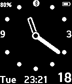

ShoOne Watchface for Pebble
===========================

This is a highly readable analog watchface for the [Pebble Smartwatch][pebble], intended for every-day use.

This version is built on the [Pebble SDK 3.0][sdk3], the project is a simplified version of the incredibly good-looking [pebbleone][PebbleONE] watchface.

Contributions are highly welcome - just send me a [pull request][pullreq].

-- Sam, Aug 2015

[pebble]:  https://getpebble.com/
[pebbleone]: https://github.com/bertfreudenberg/PebbleONE
[sdk3]:    https://developer.getpebble.com/sdk/changelogs/3.2.1/
[pullreq]: https://help.github.com/articles/using-pull-requests
